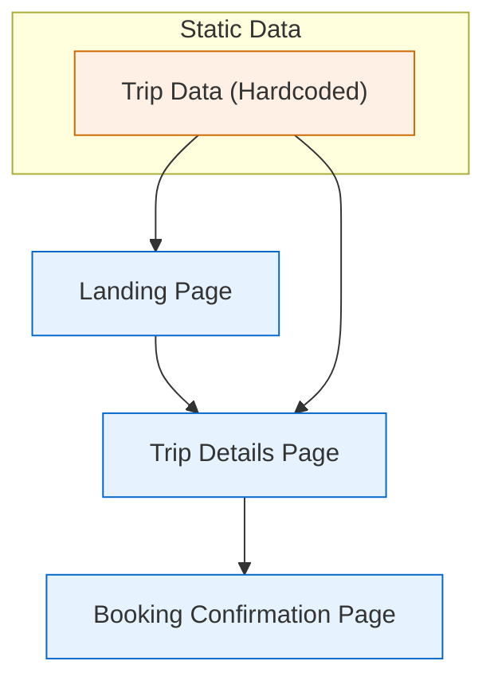

# System Patterns: Travel Booking Platform
*Version: 1.0*
*Created: 2025-04-06*
*Last Updated: 2025-04-06*

## Architecture Overview
The initial architecture is a static site built with Next.js, with trip data hardcoded at build time. The site is modular, with clear separation between landing, trip details, and booking confirmation pages. Future phases will introduce dynamic data fetching from Google Sheets or Postgres and an admin interface for content management.

## Key Components
- Landing Page: Displays hero section, featured trips, and booking entry point
- Trip Details Page: Shows detailed information for each trip
- Booking Confirmation Page: Confirms user booking and displays summary
- Data Source: Static data (initial phase), Google Sheets/Postgres (future phase)

## Design Patterns in Use
- Modular Page Components: Each page is a self-contained module
- Static Site Generation (SSG): Next.js builds static pages at deploy time
- Progressive Enhancement: Architecture allows for easy addition of dynamic features later

## Data Flow
- Initial Phase: Data is hardcoded in the codebase and loaded at build time
- Future Phase: Data will be fetched from Google Sheets/Postgres via API routes at runtime

## Key Technical Decisions
- Use Next.js for modular, ARM-compatible, Vercel-ready static site
- Start with static data for simplicity and reliability
- Plan for future dynamic data integration and admin interface
- Ensure architecture supports PDPA compliance and secure data handling

## Component Relationships
- Landing Page links to Trip Details Page for each trip
- Trip Details Page links to Booking Confirmation Page after booking
- All pages share common layout and navigation components

## Architecture Diagram

---

*This document captures the system architecture and design patterns used in the project.* 